# Optymalizacja rozmieszczenia stacji ładowania pojazdów elektrycznych

## 1. Model Opisowy

Problem polega na optymalizacji lokalizacji stacji ładowania w taki sposób, aby zminimalizować koszty transportu użytkowników oraz kary za brak obsługi popytu, przy jednoczesnym zachowaniu ograniczeń budżetowych i technicznych (przepustowość ładowarek).

### Zbiory i Indeksy

- $I$ – Zbiór punktów popytu (np. skrzyżowania, osiedla, biurowce), indeks $i \in I$.
- $J$ – Zbiór potencjalnych lokalizacji stacji ładowania, indeks $j \in J$.

### Parametry

- $w_i$ – Wielkość popytu w punkcie $i$ (liczba pojazdów wymagających obsłużenia).
- $d_{ij}$ – Odległość (lub czas przejazdu) między punktem popytu $i$ a lokalizacją $j$.
- $f_j$ – Stały koszt otwarcia stacji w lokalizacji $j$.
- $c_j$ – Koszt instalacji pojedynczego punktu ładowania (ładowarki) w lokalizacji $j$.
- $K$ – Wydajność jednej ładowarki (liczba aut, które może obsłużyć w danym oknie czasowym).
- $p$ – Jednostkowy koszt kary za nieobsłużenie popytu w punkcie.
- $B$ – Całkowity dostępny budżet na budowę stacji i zakup ładowarek.
- $M$ – Maksymalna dopuszczalna liczba ładowarek w pojedynczej stacji $j$.

---

## 2. Zmienne Decyzyjne

- **Zmienna lokalizacji:**
  $y_j = \begin{cases} 1 & \text{jeśli otwieramy stację w lokalizacji } j \\ 0 & \text{w przeciwnym razie} \end{cases}$

- **Liczba ładowarek:**
  $k_j \in \{0, 1, 2, \dots, M\}$ – Liczba zainstalowanych ładowarek w lokalizacji $j$.

- **Zmienna przypisania popytu:**
  $x_{ij} \ge 0$ – Wielkość popytu z punktu $i$ obsługiwana przez stację $j$.

- **Nieobsłużony popyt (zmienna dopełniająca):**
  $s_i \ge 0$ – Wielkość popytu w punkcie $i$, która nie została obsłużona przez żadną stację.

---

## 3. Funkcja Celu

Minimalizujemy sumę całkowitego kosztu transportu oraz kar za nieobsłużony popyt:

$$\min \quad Z = \sum_{i \in I} \sum_{j \in J} (d_{ij} \cdot x_{ij}) + \sum_{i \in I} (p \cdot s_i)$$

---

## 4. Algorytm Mrówkowy

### 1. Iteracja mrówki

- mrówka przechodzi przez graf i wybiera lokalizacje i liczby ładowarek, probabilistycznie na podstawie śladów feromonowych
- na koniec trasy zostawia całą infrastrukturę
- na jej podstawie, wiemy gdzie są ładowarki, więc zmienne _y_ i _k_ stają się stałymi

### 2. Wyliczenie popytu

- przypisujemy popyt z miejsc (_w_) do utworzonych stacji (Transportation Problem)
- algorytm zachłanny:
  - sortujemy pary (punkt popytu _i_, stacja _j_) rosnąco według odległości _d_ij_
  - bierzemy punkt popytu _i_ i przypisujemy mu stację _j_ tak długo, aż zapełnimy popyt albo limit stacji _K _ k_j*. Dzięki temu znajdujemy *x_ij\*
  - powtarzamy dla kolejnych miejsc i stacji
  - jeśli komuś zabrakło miejsca, jest to zmienna _s_i_ (karająca nieobsłużony popyt)

### 3. Funkcja celu

- na podstawie _d_ij, P_ i wyliczonych _x_ij, s_i_ liczymy koszt (karę) danej mrówki

### 4. Aktualizacja feromonów

- wszystkie ślady feromonowe na mapie są lekko osłabiane, aby uniknąć szybkiego utknięcia w słabym rozwiązaniu i odkrywać inne
- mrówki, które uzyskały najniższą wartość funkcji celu, zostawiają ślad na wybranych przez siebie lokalizacjach

## 5. Ograniczenia

- **Ograniczenie budżetowe:**
  Suma kosztów stałych otwarcia stacji oraz kosztów zmiennych (liczba ładowarek) musi mieścić się w budżecie:
  $$\sum_{j \in J} (f_j \cdot y_j + c_j \cdot k_j) \le B$$

- **Zaspokojenie popytu (bilans):**
  Suma popytu obsłużonego przez wszystkie stacje oraz popytu nieobsłużonego (penalizowanego) musi być równa zapotrzebowaniu w danym punkcie:
  $$\sum_{j \in J} x_{ij} + s_i = w_i \quad \forall i \in I$$

- **Wydajność stacji (przepustowość):**
  Liczba aut obsłużonych przez stację $j$ nie może przekroczyć łącznej wydajności zainstalowanych tam ładowarek:
  $$\sum_{i \in I} x_{ij} \le K \cdot k_j \quad \forall j \in J$$

- **Logika instalacji ładowarek:**
  Ładowarki mogą zostać zainstalowane tylko wtedy, gdy stacja w danej lokalizacji została otwarta. Ponadto ich liczba nie może przekroczyć limitu $M$:
  $$k_j \le M \cdot y_j \quad \forall j \in J$$

- **Logika przypisania popytu:**
  Popyt z punktu $i$ może zostać przypisany do stacji $j$ tylko wtedy, gdy stacja w tej lokalizacji zostanie otwarta, i nie może on przekroczyć całkowitego dostępnego popytu w danym punkcie:
  $$x_{ij} \le w_i \cdot y_j \quad \forall i \in I, \forall j \in J$$

## Eksperymenty obliczeniowe

Stałe użyte w eksperymentach dotyczących liczby mrówek i iteracji:

```
COST_F = 250 # Stały koszt otwarcia stacji (k PLN)
COST_C = 120  # Koszt jednej ładowarki DC (k PLN)
M_LIMIT = 6      # Maksymalna liczba ładowarek na stacji
BUDGET = 4500 # Całkowity budżet (k PLN)
K = 10           # Przykładowa wydajność (aut na ładowarkę)
P = 5
```

Eksperymenty zostały wykonane dla dwóch różnych funkcji przypisania popytu:

- assign_demand1 (domyślna) - Łączy punkty w pary na podstawie samej odległości. Sortuje wszystkie możliwe kombinacje od najbliższej do najdalszej i przydziela zasoby po kolei, dopóki nie wyczerpie pojemności lub popytu.

- assign_demand2 - W każdej iteracji wybiera ten punkt popytu, który najbardziej „ucierpi” (poniesie największy koszt/stratę odległości), jeśli nie zostanie obsłużony przez swoją najbliższą, optymalną stację. Gdy stacja się zapełnia, kolejka priorytetowa jest przeliczana na nowo.

### 1. Wpływ liczby mrówek na czas i wartość funkcji kosztu (assign_demand1)

| num_ants | Min Koszt | Max Koszt | Średni Koszt | Odchylenie Std | Czas (s) |
| -------: | --------: | --------: | -----------: | -------------: | -------: |
|        5 |   4272.91 |   4672.47 |      4436.65 |         121.15 |   0.1459 |
|       10 |   4210.99 |   4560.01 |       4415.4 |         129.05 |   0.2907 |
|       20 |   4210.99 |   4423.11 |      4299.57 |          61.28 |   0.6258 |
|       50 |   4210.99 |   4332.96 |      4235.38 |          48.79 |   1.2316 |
|      100 |   4210.99 |   4272.91 |      4217.18 |          18.58 |   2.9676 |

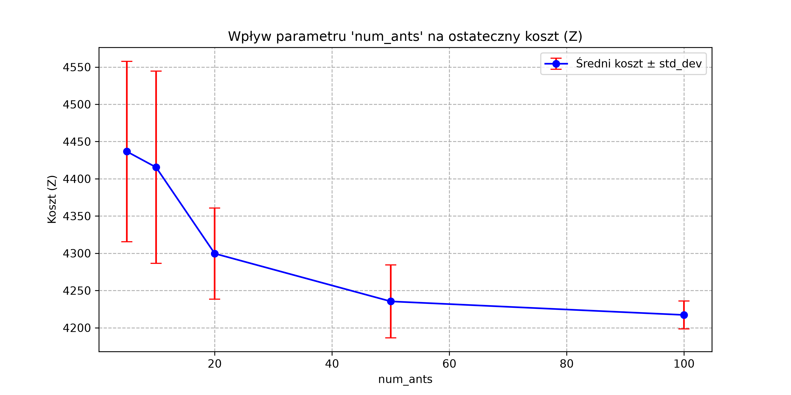

### 2. Wpływ liczby mrówek na czas i wartość funkcji kosztu (assign_demand2)

| num_ants | Min Koszt | Max Koszt | Średni Koszt | Odchylenie Std | Czas (s) |
| -------: | --------: | --------: | -----------: | -------------: | -------: |
|        5 |   4389.67 |   5415.38 |      4864.55 |         341.42 |   0.2109 |
|       10 |   4389.67 |   5170.38 |      4730.16 |          345.3 |   0.3543 |
|       20 |   4389.67 |   5133.33 |      4465.88 |         222.49 |   0.6826 |
|       50 |   4389.67 |   4941.75 |      4445.34 |         165.48 |   1.4431 |
|      100 |   4389.67 |   4394.29 |      4390.13 |           1.39 |   3.1559 |

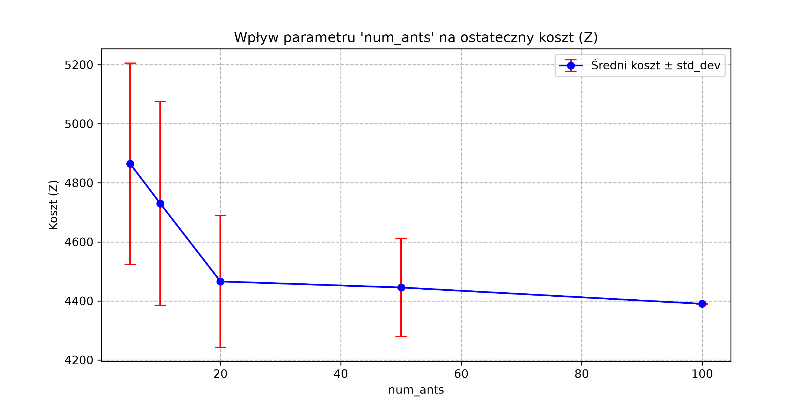

### 3. Wpływ liczby iteracji na czas i wartość funkcji kosztu (assign_demand1)

| num_iterations | Min Koszt | Max Koszt | Średni Koszt | Odchylenie Std | Czas (s) |
| -------------: | --------: | --------: | -----------: | -------------: | -------: |
|             10 |   4332.96 |   5047.68 |      4576.28 |          219.4 |   0.0832 |
|             20 |   4210.99 |   4730.78 |      4394.54 |         177.74 |   0.1246 |
|             50 |   4210.99 |   4423.11 |      4284.99 |          67.29 |   0.2887 |
|            100 |   4210.99 |   4493.87 |      4270.36 |           84.8 |   0.5836 |
|            200 |   4210.99 |   4336.02 |      4229.68 |          39.96 |   1.1717 |

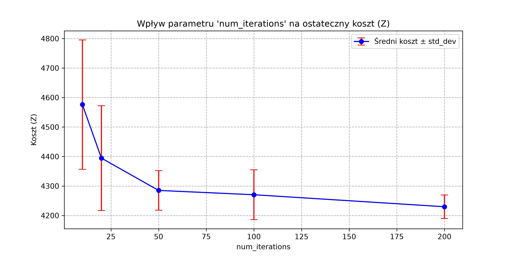

### 4. Wpływ liczby iteracji na czas i wartość funkcji kosztu (assign_demand2)

| num_iterations | Min Koszt | Max Koszt | Średni Koszt | Odchylenie Std | Czas (s) |
| -------------: | --------: | --------: | -----------: | -------------: | -------: |
|             10 |   4394.29 |   5673.59 |      5173.41 |         540.26 |   0.0708 |
|             20 |   4389.67 |   5462.56 |      4874.22 |         426.88 |   0.1453 |
|             50 |   4389.67 |   5169.36 |      4791.97 |          333.6 |   0.3585 |
|            100 |   4389.67 |   4985.28 |      4559.65 |         259.89 |   0.7103 |
|            200 |   4389.67 |   4985.28 |      4449.23 |         178.68 |   1.1016 |

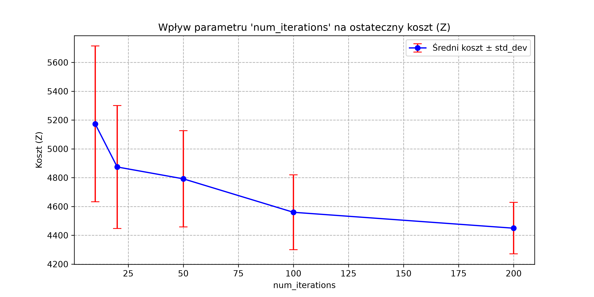

### Wielokryteriowy Grid Search - heurystyki, strategie wzmacniania i parametry alpha/beta

Przeprowadzono pełny grid search na większej instancji problemu (30 potencjalnych lokalizacji, budżet ograniczający wybór do ok. 20 z nich), testując pięć heurystyk (`cost`, `demand`, `weighted_demand`, `gravity`, `coverage_efficiency`), dwie strategie wzmacniania feromonu (`all-ants` - wzmocnienie od wszystkich mrówek w iteracji, `elite-3` - wzmocnienie tylko od 3 najlepszych) oraz kombinacje parametrów alpha ∈ {0.2, 0.5, 1.0} i beta ∈ {1.0, 2.0}.

**Heurystyki** \
Funkcja `_get_heuristic(j)` ocenia atrakcyjność lokalizacji $j$ dla mrówki, łącząc koszt budowy stacji z różnymi miarami pokrycia popytu w okolicy:

- **`cost`** - czysto kosztowa: $1/\text{koszt}_j$. Preferuje najtańsze lokalizacje, niezależnie od tego, ile popytu znajduje się w okolicy.
- **`demand`** - do kosztu dodaje sumę popytu z punktów leżących bliżej niż `threshold`; liczy się tylko popyt "lokalny" w obrębie sztywnego progu odległości, dalsze punkty nie mają żadnego wpływu.
- **`weighted_demand`** - uwzględnia popyt z *wszystkich* punktów, ważony odwrotnie proporcjonalnie do odległości ($w_i / (d_{ij}+1)$), bez sztywnego progu — bliskie punkty liczą się znacznie mocniej niż dalekie, ale każdy ma jakiś wpływ.
- **`coverage_efficiency`** - premiuje lokalizacje będące *jedynym* bliskim wyborem dla danego punktu popytu (najbliższa stacja, a druga najbliższa leży dalej niż `threshold`); liczy tylko popyt pokrywany "wyłącznie" przez tę stację, zniechęcając do duplikowania pokrycia już dobrze obsłużonych obszarów.
- **`gravity`** - model grawitacyjny: waży popyt odwrotnością *kwadratu* odległości ($w_i / (d_{ij}+1)^2$), czyli silniej premiuje bliskość niż `weighted_demand` — odległe punkty popytu mają praktycznie zerowy wpływ na wynik.

Każdy wariant (oprócz samego kosztu) dzieli ostatecznie wynik przez koszt lokalizacji, więc nawet przy uwzględnieniu popytu tańsze stacje pozostają w przewadze.

**TOP 10 konfiguracji (najniższe Z):**

| strategy | heuristic       | alpha | beta |    avg_Z |  std_Z | śr. stacji | budżet (%) |
| -------: | :-------------- | ----: | ---: | -------: | -----: | ---------: | ---------: |
| all-ants | gravity         |   0.5 |  2.0 | 35891160 | 129435 |       20.0 |      99.55 |
|  elite-3 | gravity         |   1.0 |  2.0 | 36054780 | 293053 |       20.0 |      99.93 |
| all-ants | gravity         |   1.0 |  2.0 | 36104640 | 101921 |       20.0 |      99.59 |
| all-ants | gravity         |   0.2 |  2.0 | 36110830 | 349100 |       20.0 |      99.03 |
|  elite-3 | gravity         |   0.5 |  2.0 | 36277130 |  70700 |       20.0 |      99.50 |
|  elite-3 | gravity         |   0.2 |  2.0 | 36294260 |  87830 |       20.0 |      99.47 |
| all-ants | weighted_demand |   0.2 |  2.0 | 36375970 |  70322 |       20.5 |      99.58 |
| all-ants | gravity         |   0.2 |  1.0 | 36393960 | 191052 |       20.0 |      99.55 |
|  elite-3 | gravity         |   0.2 |  1.0 | 36453110 |   6820 |       20.0 |      99.02 |
| all-ants | gravity         |   0.5 |  1.0 | 36480590 | 185273 |       19.5 |      99.32 |

**Średnie Z według heurystyki:**

| heuristic           |    avg_Z |   std_Z |   best_Z |
| :------------------ | -------: | ------: | -------: |
| demand              | 36559270 |       0 | 36559270 |
| gravity             | 36813280 |  720330 | 35891160 |
| weighted_demand     | 38114140 | 1101622 | 36375970 |
| cost                | 38608100 |  995293 | 36919280 |
| coverage_efficiency | 39283800 |  700665 | 37707000 |

**Średnie Z według strategii wzmacniania:**

| strategy |    avg_Z |   std_Z |   best_Z |
| :------- | -------: | ------: | -------: |
| all-ants | 37812450 | 1316141 | 35891160 |
| elite-3  | 37938980 | 1313728 | 36054780 |

Rozpiętość między najlepszą a najgorszą konfiguracją wyniosła 4 312 839, a średnie odchylenie standardowe wewnątrz pojedynczej konfiguracji (szum stochastyczności ACO) wyniosło 380 739 - stosunek sygnał/szum ≈ 11,3x, co potwierdza, że zaobserwowane różnice między heurystykami i parametrami są realne, a nie efektem przypadku.

**Najlepsza znaleziona konfiguracja:** heurystyka `gravity`, alpha = 0.5, beta = 2.0, strategia `all-ants` — średnie Z = 35 891 163,53 (std = 129 434,50), śr. liczba stacji 20,0/30, śr. wykorzystanie budżetu 104 906 (99,6%).

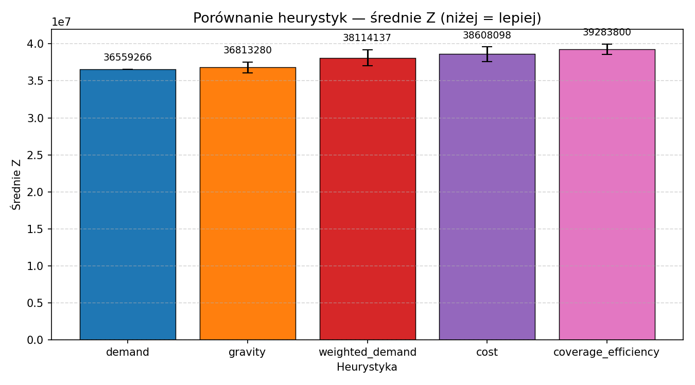
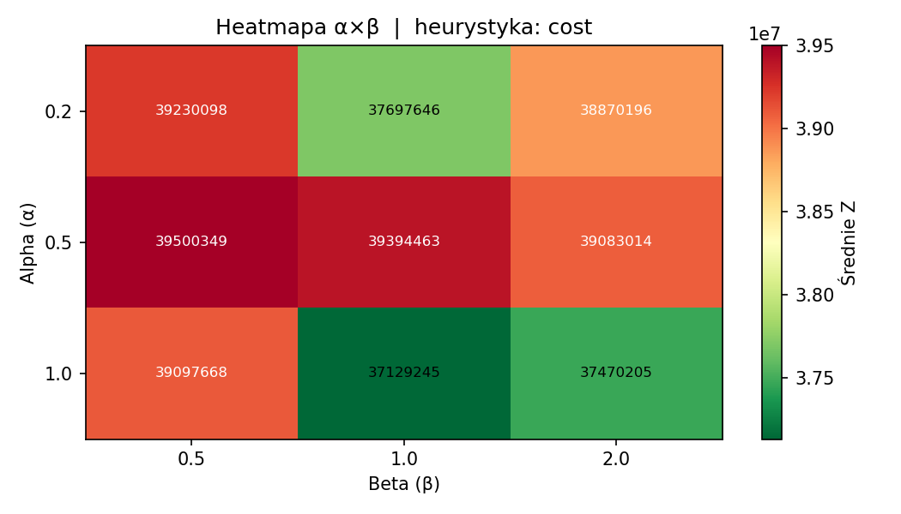
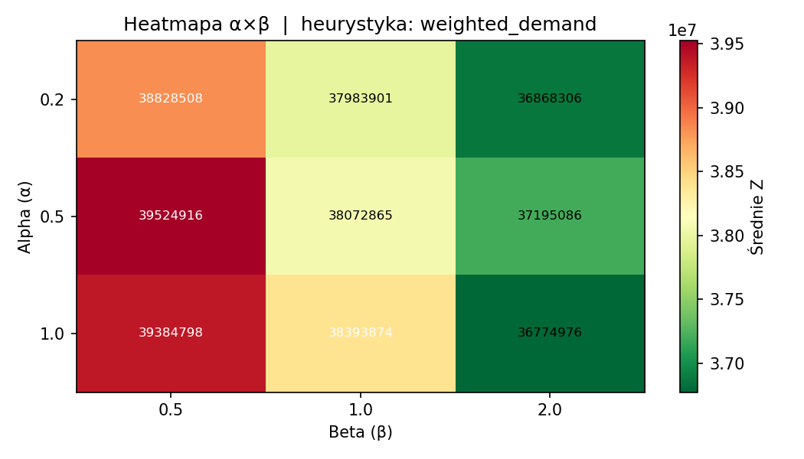
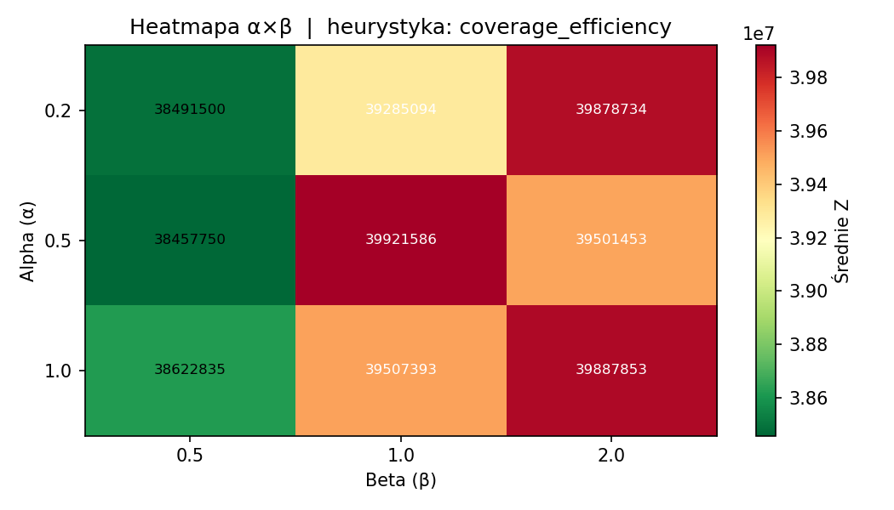
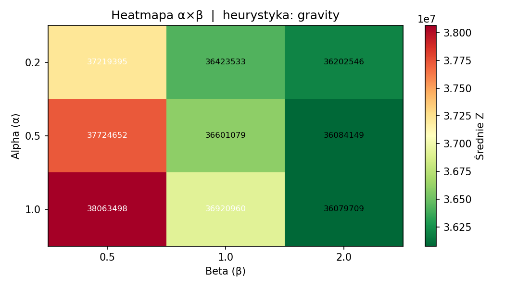
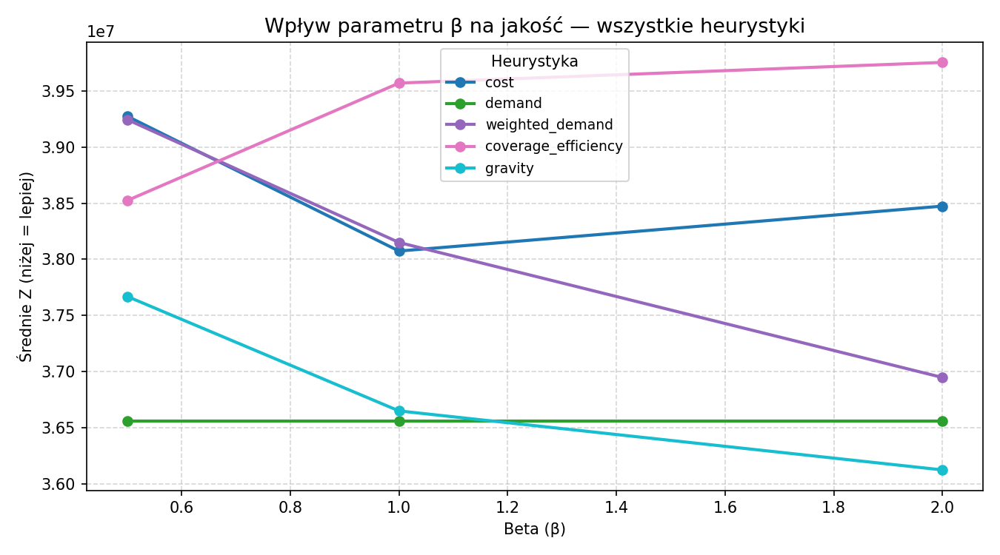
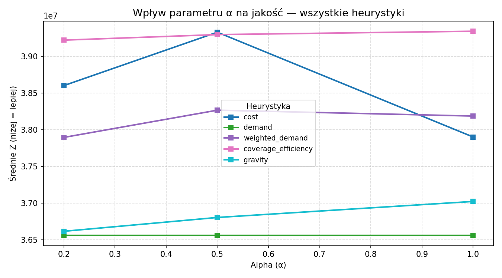
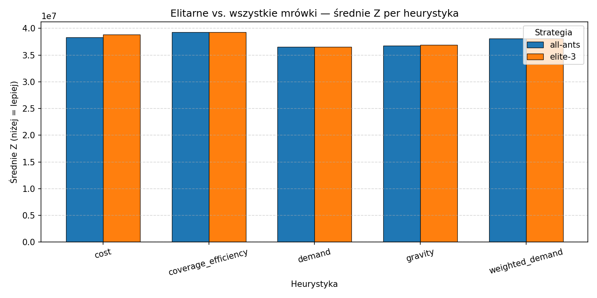
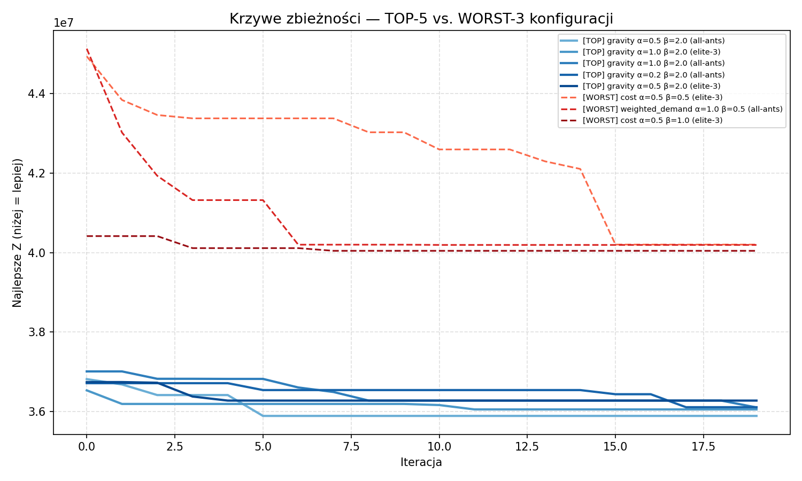
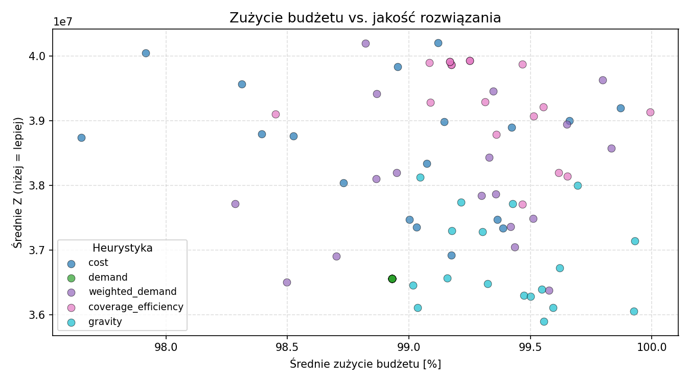
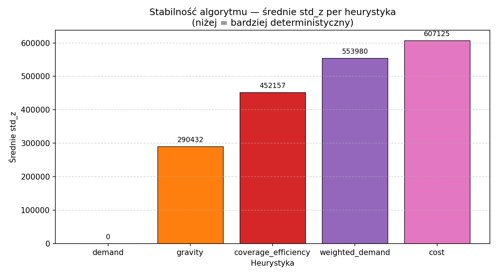

<!--
# Optymalizacja sieci stacji ładowania aut elektrycznych

## Model Opisowy

- **_I_** - Zbiór punktów popytu (np. skrzyżowania, osiedla, biurowce). Indeksowane jako _i_.

- **_J_** - Zbiór potencjalnych lokalizacji stacji ładowania (np. parkingi przy centrach handlowych, stacje paliw). Indeksowane jako _j_.

- **_w<sub>i_** - Waga (natężenie ruchu, popyt) w danym punkcie _i_.

- **_d<sub>ij</sub>_** - Dystans (lub czas przejazdu) pomiędzy punktem popytu _i_ a potencjalną stacją ładowania _j_.

- **_f<sub>i_** - Koszt instalacji stacji w lokalizacji _j_.

- **_B_** - Całkowity dostępny budżet na projekt.

## Zmienne decyzyjne

- **_Zmienna lokalizacji_** - y<sub>j</sub> ∈ {0, 1} - 1 oznacza, że stawiamy stację w lokalizacji _j_; 0 wpp.

- **_Zmienna przypisania_** - x<sub>ij</sub> ∈ {0, 1} - 1 oznacza, że punkt _i_ jest obsługiwany przez stację w lokalizacji _j_; 0 wpp.

## Funkcja celu

Minimalizacja całkowitego, ważonego dystansu do stacji.

Min Σ<sub>i ∈ I</sub> Σ<sub>j ∈ J</sub> (w<sub>i</sub> · d<sub>ij</sub> · x<sub>ij</sub>)

## Ograniczenia

- **Ograniczenie budżetowe:** Nie możemy przekroczyc ustalonego budżetu. \
  Σ<sub>i ∈ I</sub> (f<sub>j</sub> · y<sub>j</sub>) ≤ B

- **Ograniczenie punktów popytu:** Każdy punkt popytu musi mieć przypisaną dokładnie jedną stację. \
  Dla każdego _i_: \
  Σ<sub>j ∈ J</sub> x<sub>ij</sub> = 1

- **Ograniczenie logiki przypisania:** Punkt popytu _i_ może zostać przypisany do stacji _j_ tylko wtedy, gdy ta stacja zostanie wybudowana.
  \
  Dla każdego _i_ i _j_:\
  x<sub>ij</sub> ≤ y<sub>j</sub> -->
