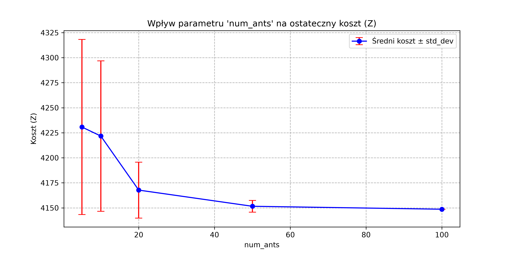
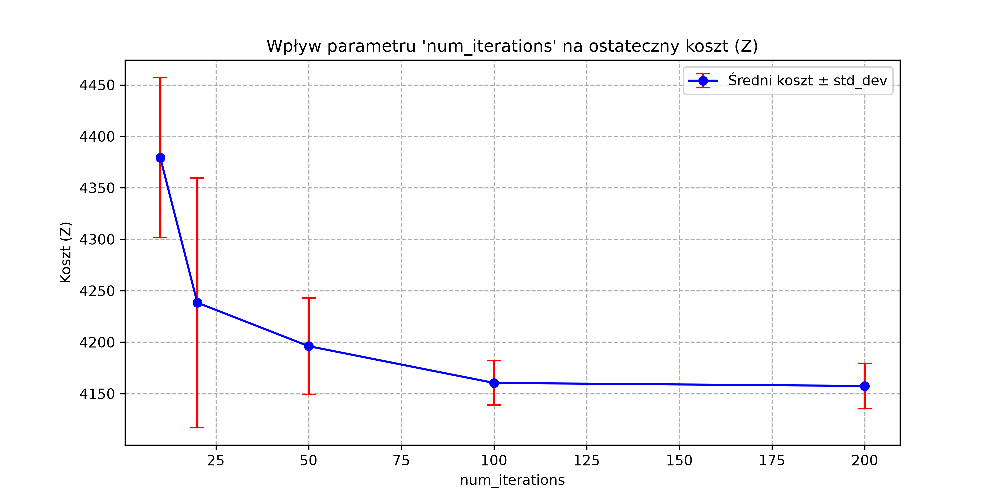

# Optymalizacja rozmieszczenia stacji ładowania pojazdów elektrycznych

## 1. Model Opisowy

Problem polega na optymalizacji lokalizacji stacji ładowania w taki sposób, aby zminimalizować koszty transportu użytkowników oraz kary za brak obsługi popytu, przy jednoczesnym zachowaniu ograniczeń budżetowych i technicznych (przepustowość ładowarek).

### Zbiory i Indeksy
- $I$ – Zbiór punktów popytu (np. skrzyżowania, osiedla, biurowce), indeks $i \in I$.
- $J$ – Zbiór potencjalnych lokalizacji stacji ładowania, indeks $j \in J$.

### Parametry
- $w_i$ – Wielkość popytu w punkcie $i$ (liczba pojazdów wymagających obsłużenia).
- $d_{ij}$ – Odległość (lub czas przejazdu) między punktem popytu $i$ a lokalizacją $j$.
- $f_j$ – Stały koszt otwarcia stacji w lokalizacji $j$.
- $c_j$ – Koszt instalacji pojedynczego punktu ładowania (ładowarki) w lokalizacji $j$.
- $K$ – Wydajność jednej ładowarki (liczba aut, które może obsłużyć w danym oknie czasowym).
- $p$ – Jednostkowy koszt kary za nieobsłużenie popytu w punkcie.
- $B$ – Całkowity dostępny budżet na budowę stacji i zakup ładowarek.
- $M$ – Maksymalna dopuszczalna liczba ładowarek w pojedynczej stacji $j$.

---

## 2. Zmienne Decyzyjne

* **Zmienna lokalizacji:**
    $y_j = \begin{cases} 1 & \text{jeśli otwieramy stację w lokalizacji } j \\ 0 & \text{w przeciwnym razie} \end{cases}$

* **Liczba ładowarek:**
    $k_j \in \{0, 1, 2, \dots, M\}$ – Liczba zainstalowanych ładowarek w lokalizacji $j$.

* **Zmienna przypisania popytu:**
    $x_{ij} \ge 0$ – Wielkość popytu z punktu $i$ obsługiwana przez stację $j$.

* **Nieobsłużony popyt (zmienna dopełniająca):**
    $s_i \ge 0$ – Wielkość popytu w punkcie $i$, która nie została obsłużona przez żadną stację.

---

## 3. Funkcja Celu

Minimalizujemy sumę całkowitego kosztu transportu oraz kar za nieobsłużony popyt:

$$\min \quad Z = \sum_{i \in I} \sum_{j \in J} (d_{ij} \cdot x_{ij}) + \sum_{i \in I} (p \cdot s_i)$$

---

## 4. Ograniczenia

* **Ograniczenie budżetowe:**
    Suma kosztów stałych otwarcia stacji oraz kosztów zmiennych (liczba ładowarek) musi mieścić się w budżecie:
    $$\sum_{j \in J} (f_j \cdot y_j + c_j \cdot k_j) \le B$$

* **Zaspokojenie popytu (bilans):**
    Suma popytu obsłużonego przez wszystkie stacje oraz popytu nieobsłużonego (penalizowanego) musi być równa zapotrzebowaniu w danym punkcie:
    $$\sum_{j \in J} x_{ij} + s_i = w_i \quad \forall i \in I$$

* **Wydajność stacji (przepustowość):**
    Liczba aut obsłużonych przez stację $j$ nie może przekroczyć łącznej wydajności zainstalowanych tam ładowarek:
    $$\sum_{i \in I} x_{ij} \le K \cdot k_j \quad \forall j \in J$$

* **Logika instalacji ładowarek:**
    Ładowarki mogą zostać zainstalowane tylko wtedy, gdy stacja w danej lokalizacji została otwarta. Ponadto ich liczba nie może przekroczyć limitu $M$:
    $$k_j \le M \cdot y_j \quad \forall j \in J$$

* **Logika przypisania popytu:**
    Popyt z punktu $i$ może zostać przypisany do stacji $j$ tylko wtedy, gdy stacja w tej lokalizacji zostanie otwarta, i nie może on przekroczyć całkowitego dostępnego popytu w danym punkcie:
    $$x_{ij} \le w_i \cdot y_j \quad \forall i \in I, \forall j \in J$$

## Eksperymenty obliczeniowe

### 1. Wpływ liczby mrówek na czas i wartość funkcji kosztu

|   num_ants |   Min Koszt |   Max Koszt |   Średni Koszt |   Odchylenie Std |   Czas (s) |
|-----------:|------------:|------------:|---------------:|-----------------:|-----------:|
|          5 |     4148.64 |     4416.25 |        4230.75 |            87.37 |     0.1662 |
|         10 |     4148.64 |     4360.99 |        4221.71 |            75.14 |     0.3144 |
|         20 |     4148.64 |     4222.05 |        4167.74 |            27.89 |     0.5925 |
|         50 |     4148.64 |     4163.36 |        4151.58 |             5.89 |     1.2644 |
|        100 |     4148.64 |     4148.64 |        4148.64 |             0    |     3.3473 |
    

### 2. Wpływ liczby iteracji na czas i wartość funkcji kosztu

|   num_iterations |   Min Koszt |   Max Koszt |   Średni Koszt |   Odchylenie Std |   Czas (s) |
|-----------------:|------------:|------------:|---------------:|-----------------:|-----------:|
|               10 |     4241.69 |     4491.51 |        4379.42 |            77.74 |     0.0731 |
|               20 |     4163.36 |     4561.74 |        4238.37 |           121.29 |     0.1524 |
|               50 |     4148.64 |     4276    |        4196.14 |            46.87 |     0.3305 |
|              100 |     4148.64 |     4222.05 |        4160.4  |            21.58 |     0.71   |
|              200 |     4148.64 |     4222.05 |        4157.45 |            21.98 |     0.9011 |

<!-- 
# Optymalizacja sieci stacji ładowania aut elektrycznych

## Model Opisowy

- **_I_** - Zbiór punktów popytu (np. skrzyżowania, osiedla, biurowce). Indeksowane jako _i_.

- **_J_** - Zbiór potencjalnych lokalizacji stacji ładowania (np. parkingi przy centrach handlowych, stacje paliw). Indeksowane jako _j_.

- **_wi_** - Waga (natężenie ruchu, popyt) w danym punkcie _i_.

- **_dij_** - Dystans (lub czas przejazdu) pomiędzy punktem popytu _i_ a potencjalną stacją ładowania _j_.

- **_fi_** - Koszt instalacji stacji w lokalizacji _j_.

- **_B_** - Całkowity dostępny budżet na projekt.

## Zmienne decyzyjne

- **_Zmienna lokalizacji_** - yj ∈ {0, 1} - 1 oznacza, że stawiamy stację w lokalizacji _j_; 0 wpp.

- **_Zmienna przypisania_** - xij ∈ {0, 1} - 1 oznacza, że punkt _i_ jest obsługiwany przez stację w lokalizacji _j_; 0 wpp.

## Funkcja celu

Minimalizacja całkowitego, ważonego dystansu do stacji.

Min Σi ∈ I Σj ∈ J (wi · dij · xij)

## Ograniczenia

- **Ograniczenie budżetowe:** Nie możemy przekroczyc ustalonego budżetu. \
  Σi ∈ I (fj · yj) ≤ B

- **Ograniczenie punktów popytu:** Każdy punkt popytu musi mieć przypisaną dokładnie jedną stację. \
  Dla każdego _i_: \
  Σj ∈ J xij = 1

- **Ograniczenie logiki przypisania:** Punkt popytu _i_ może zostać przypisany do stacji _j_ tylko wtedy, gdy ta stacja zostanie wybudowana.
  \
  Dla każdego _i_ i _j_:\
  xij ≤ yj -->
